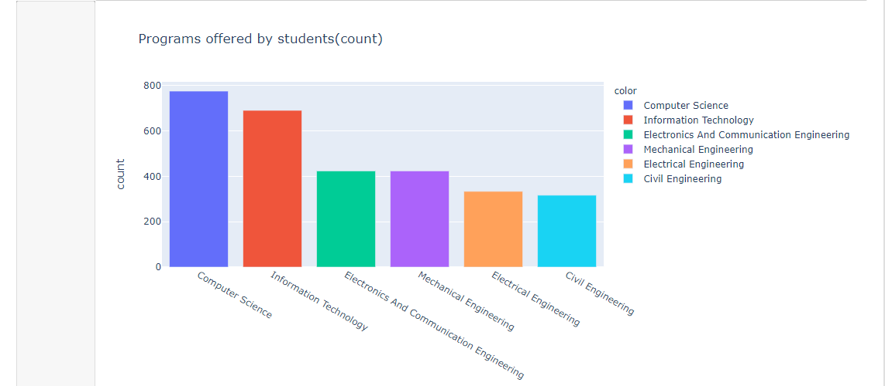

# College Placement Prediction

#### A simple analysis and prediction on a college placement dataset from kaggle https://www.kaggle.com/

__NOTE__: To avoid confusion with already installed packages it's advisable to create a virtual environment before proceeding with the steps below.

For access to the code git clone the repository to a directory on your pc 👇
```
git clone https://github.com/jellyCodee/CollegePlacementPrediction.git
```

Now in the directory with the _requirements.txt_ file run the command below 👇
```
pip install -r requirements.txt
```

After successful installation you should be able to run the notebook without any issues.


In the case you get an error of the format "No module named {module name}, look it up on google on how to install such module or package.

Also the _collection_ and _pickle_ packages come pre-installed with python installation but in the case of you getting an error when importing them just look it up as I previously stated.

That's basically it. Enjoy 👍

Made with ❤ JellyCodee
